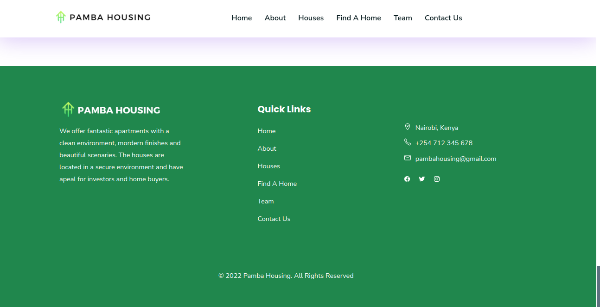

## PAMBA HOUSING TEAM PROJECT.

### PREVIEW OF THE PROJECT: 
[PAMBA HOUSING WEBSITE LIVE PREVIEW](https://waasike.github.io/hackathon_portfolio/)

### 1. Choose a project - Project should have an economical or commercial benefit.
This website helps 

### 2. Define problem statement –For any project to have value, it must be a solution to a specific problem, if your project does not solve any problem then no one will need it/use it. 
This project reduces the gap between the agent and the individual in search for a house.By getting rid of conmen.

### 3. State the purpose of your project: What it does in terms of functionality
Ability for a user view the houses.
The user is able to sign up (at a fee).
And later login after verification of their email address.
The user is able to fill in a form of the house of preference. 
The individual then gets in touch with his/her agent.

### 4. State the technical requirements for your project
Programming Languages used; HTML, CSS, JavaScript
Frameworks used; Bootstrap
Coding Environment; Visual Studio Code
Database System; 
Designing platform; Figma
Hosting platform; GitHub

### Project plan
1. Designing the project on Figma
2. Hard coding using HTML
3. Adding various styling using CSS
4. Adding the basic functionality using Javascript

### CONTRIBUTERS OF THE PROJECT
1.  Mitchelle Wasike|mitchellewasikee@gmail.com |0746795376
2.  Maria Kimani |mgmkimani@gmail.com |0757612568
3. Stephen Nderitu | |0708290960
