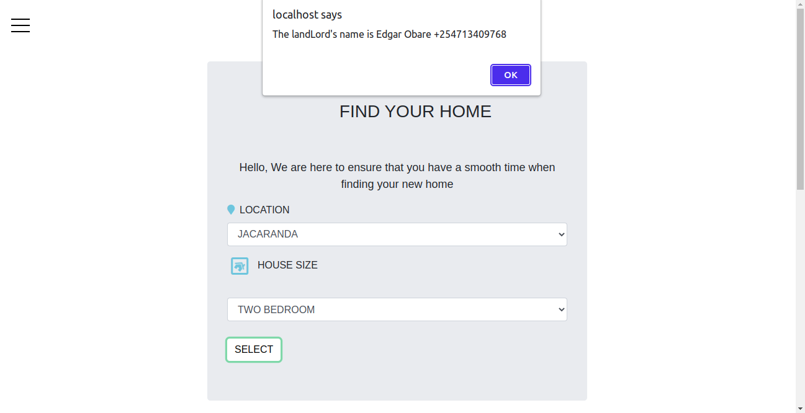

## PAMBA HOUSING TEAM PROJECT.

### N/B 
• You need to have installed Xampp 
• Have running servers i.e Apache and Mysql Database 
• Refer to pamba.sql file for mysql database queries

### PREVIEW OF THE PROJECT: 

### 1. Choose a project - Project should have an economical or commercial benefit.
This website helps establish our image by letting the audience know who we are and what we represent. The website provides reliable information to the consumers and helps users cut on costs.  

### 2. Define problem statement –For any project to have value, it must be a solution to a specific problem, if your project does not solve any problem then no one will need it / use it. 
This project reduces the gap between the agent and the individual in search for a house. By getting rid of conmen.

### 3. State the purpose of your project: What it does in terms of functionality
• Ability for a user to view the houses. 
• The user is able to sign up (at a fee). 
• And later login after verification of their email address. 
• The user is able to fill in a form of the house of preference.  
• The individual then gets in touch with his/her agent. 

### 4. State the technical requirements for your project
Programming Languages used; <b> HTML, CSS, JavaScript and PHP </b>  
Frameworks used; <b> Bootstrap </b>  
Coding Environment; <b> Visual Studio Code </b>  
Database System; <b> MySql </b>  
Designing platform; <b> Figma </b>  
Hosting platform; <b> GitHub </b>  
[PAMBA HOUSING WEBSITE LIVE PREVIEW](https://waasike.github.io/Pamba-Housing-Group-Project/)

### Project plan
1. Designing the project on Figma
2. Hard coding using HTML
3. Adding various styling using CSS
4. Adding the basic functionality using Javascript
5. Using bootstrap to add design
6. Using PHP and MySql to obtain registration data from users

### CONTRIBUTERS OF THE PROJECT
1.  Mitchelle Wasike | mitchellewasikee@gmail.com | 0746795376
2.  Maria Kimani | mgmkimani@gmail.com | 0757612568
3.  Stephen Nderitu | stevenderitu99@gmail.com | 0708290960
